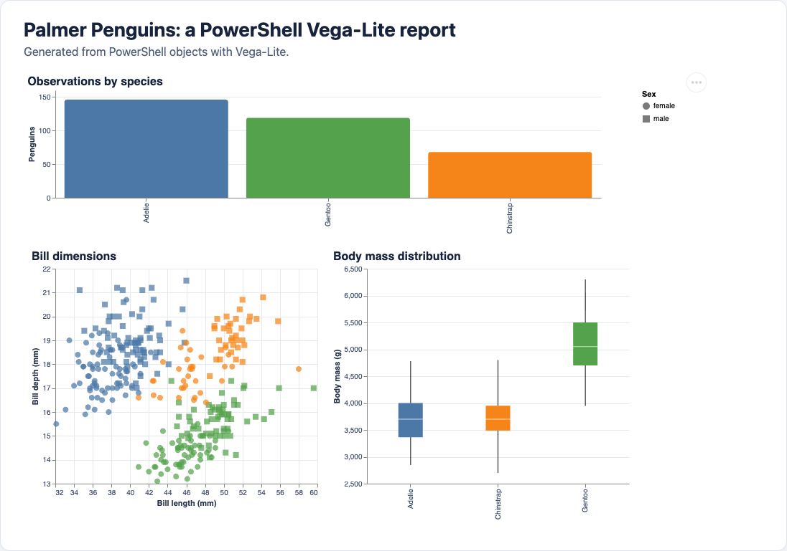

PowerShell is good at acquiring data and turning it into objects. Vega-Lite is good at turning structured data into interactive graphics. A small function is enough to connect the two without adopting a reporting framework or opening a browser from the script.

In this article, we download the [Palmer Penguins](https://allisonhorst.github.io/palmerpenguins/) dataset, clean it with ordinary PowerShell, describe three views as one Vega-Lite specification, and save the finished report as an HTML file.

The key design choice is that `Show-VegaLite` doesn't decide what to do with the HTML. It returns the document to the pipeline:

```powershell
$reportSpec |
    Show-VegaLite -PageTitle 'Palmer Penguins report' |
    Set-Content -Path ./penguins-report.html -Encoding utf8
```

That makes the renderer useful in a console script, scheduled job, CI pipeline, or notebook.

## The finished report

The example produces one HTML document containing a bar chart, scatter plot, and box plot.



The charts answer progressively richer questions:

- How many complete observations are available for each species?
- How do bill length and bill depth separate the species?
- How different are the body-mass distributions?

The saved report remains interactive. Vega-Embed provides tooltips and an action menu that can export individual views.

## Load and shape the data

The simplified Palmer Penguins dataset has 344 rows and eight columns. It contains categories, measurements, missing values, and several visible relationships, which makes it a useful alternative to the classic Iris dataset. The project publishes the data under CC0 and documents the original Palmer Station LTER sources.

PowerShell can download the CSV directly:

```powershell
$dataUrl = 'https://raw.githubusercontent.com/' +
    'allisonhorst/palmerpenguins/main/inst/extdata/penguins.csv'

$penguins = Invoke-RestMethod -Uri $dataUrl |
    ConvertFrom-Csv |
    Where-Object {
        $_.bill_length_mm -ne 'NA' -and
        $_.bill_depth_mm -ne 'NA' -and
        $_.flipper_length_mm -ne 'NA' -and
        $_.body_mass_g -ne 'NA' -and
        $_.sex -ne 'NA'
    } |
    ForEach-Object {
        [pscustomobject]@{
            species           = $_.species
            island            = $_.island
            bill_length_mm    = [double]$_.bill_length_mm
            bill_depth_mm     = [double]$_.bill_depth_mm
            flipper_length_mm = [int]$_.flipper_length_mm
            body_mass_g       = [int]$_.body_mass_g
            sex               = $_.sex
            year              = [int]$_.year
        }
    }
```

The explicit casts matter. `ConvertFrom-Csv` initially creates strings, while Vega-Lite should receive JSON numbers for quantitative fields. Removing incomplete records keeps this example focused. A production report could retain them and add a separate data-quality summary.

## Describe several charts in one specification

Vega-Lite specifications are JSON documents. PowerShell ordered hashtables and arrays let us construct the same structure while keeping the data as objects until the final serialization step.

The top-level `data` property makes the cleaned data available to every view. `vconcat` places the count chart above an `hconcat` containing the scatter and box plots:

```powershell
$reportSpec = [ordered]@{
    '$schema' = 'https://vega.github.io/schema/vega-lite/v6.json'
    data      = @{ values = @($penguins) }
    spacing   = 24
    vconcat   = @(
        @{
            width    = 760
            height   = 150
            title    = 'Observations by species'
            mark     = @{ type = 'bar'; cornerRadiusEnd = 3 }
            encoding = @{
                x = @{
                    field = 'species'
                    type  = 'nominal'
                    title = $null
                    sort  = '-y'
                }
                y = @{
                    aggregate = 'count'
                    type      = 'quantitative'
                    title     = 'Penguins'
                }
                color = @{
                    field  = 'species'
                    type   = 'nominal'
                    legend = $null
                }
                tooltip = @(
                    @{ field = 'species'; type = 'nominal'; title = 'Species' }
                    @{ aggregate = 'count'; type = 'quantitative'; title = 'Observations' }
                )
            }
        }
        @{
            hconcat = @(
                @{
                    width  = 365
                    height = 300
                    title  = 'Bill dimensions'
                    mark   = @{
                        type    = 'point'
                        filled  = $true
                        opacity = 0.72
                        size    = 65
                    }
                    encoding = @{
                        x = @{
                            field = 'bill_length_mm'
                            type  = 'quantitative'
                            title = 'Bill length (mm)'
                            scale = @{ zero = $false }
                        }
                        y = @{
                            field = 'bill_depth_mm'
                            type  = 'quantitative'
                            title = 'Bill depth (mm)'
                            scale = @{ zero = $false }
                        }
                        color = @{
                            field = 'species'
                            type  = 'nominal'
                            title = 'Species'
                        }
                        shape = @{
                            field = 'sex'
                            type  = 'nominal'
                            title = 'Sex'
                        }
                    }
                }
                @{
                    width  = 365
                    height = 300
                    title  = 'Body mass distribution'
                    mark   = @{
                        type   = 'boxplot'
                        extent = 'min-max'
                        size   = 34
                    }
                    encoding = @{
                        x = @{
                            field = 'species'
                            type  = 'nominal'
                            title = $null
                        }
                        y = @{
                            field = 'body_mass_g'
                            type  = 'quantitative'
                            title = 'Body mass (g)'
                            scale = @{ zero = $false }
                        }
                        color = @{
                            field  = 'species'
                            type   = 'nominal'
                            legend = $null
                        }
                    }
                }
            )
        }
    )
    config = @{
        view  = @{ stroke = $null }
        axis  = @{
            labelColor = '#42506a'
            titleColor = '#27334a'
            gridColor  = '#e6eaf0'
        }
        title = @{
            anchor   = 'start'
            color    = '#17233c'
            fontSize = 16
        }
        range = @{
            category = @('#4c78a8', '#f58518', '#54a24b')
        }
    }
}
```

This is still only data. No chart process has started, and PowerShell hasn't emitted HTML yet.

## Return HTML instead of taking control

`Show-VegaLite` performs four operations:

1. Serialize the specification with enough JSON depth for nested encodings.
2. Encode that JSON as UTF-8 Base64 to avoid quoting and `</script>` problems inside the page.
3. Create a small HTML document that loads pinned Vega, Vega-Lite, and Vega-Embed versions.
4. Return the document as a string.

```powershell
function Show-VegaLite {
    [CmdletBinding()]
    param(
        [Parameter(Mandatory, ValueFromPipeline)]
        [System.Collections.IDictionary]$Spec,

        [string]$PageTitle = 'Vega-Lite report',

        [ValidateSet('svg', 'canvas')]
        [string]$Renderer = 'svg'
    )

    process {
        $specJson = $Spec | ConvertTo-Json -Depth 100 -Compress
        $specBase64 = [Convert]::ToBase64String(
            [Text.Encoding]::UTF8.GetBytes($specJson)
        )
        $encodedTitle = [Net.WebUtility]::HtmlEncode($PageTitle)

        @"
<!doctype html>
<html lang="en">
<head>
  <meta charset="utf-8">
  <meta name="viewport" content="width=device-width, initial-scale=1">
  <title>$encodedTitle</title>
  <script src="https://cdn.jsdelivr.net/npm/vega@6.3.1"></script>
  <script src="https://cdn.jsdelivr.net/npm/vega-lite@6.4.3"></script>
  <script src="https://cdn.jsdelivr.net/npm/vega-embed@7.1.0"></script>
  <style>
    body { font-family: system-ui, sans-serif; margin: 2rem; }
    #vis { overflow-x: auto; }
    .error { color: #a61b1b; white-space: pre-wrap; }
  </style>
</head>
<body>
  <h1>$encodedTitle</h1>
  <div id="vis"></div>
  <script>
    const binary = atob("$specBase64");
    const bytes = Uint8Array.from(
      binary,
      character => character.charCodeAt(0)
    );
    const spec = JSON.parse(new TextDecoder().decode(bytes));

    vegaEmbed("#vis", spec, {
      mode: "vega-lite",
      renderer: "$Renderer",
      actions: true
    }).catch(error => {
      const message = document.createElement("div");
      message.className = "error";
      message.textContent = error.stack || error.message;
      document.querySelector("#vis").replaceChildren(message);
    });
  </script>
</body>
</html>
"@
    }
}
```

The function doesn't call `Set-Content`, `Out-File`, `Start-Process`, or a notebook-specific display command. That separation lets the caller choose the destination.

## Save the report

Pipe the specification through the renderer and save the returned string:

```powershell
$outputPath = Join-Path $PWD 'penguins-report.html'

$reportSpec |
    Show-VegaLite -PageTitle 'Palmer Penguins report' |
    Set-Content -Path $outputPath -Encoding utf8

Get-Item $outputPath
```

The resulting file contains the selected data and complete Vega-Lite specification. You can attach it to a ticket, publish it as a build artifact, copy it to static hosting, or open it locally.

It isn't completely offline: the HTML contains the data and chart definition, but it loads the JavaScript runtimes from jsDelivr. A fully offline variant can download those runtime files and reference local copies, at the cost of shipping several additional assets.

## Reuse the same output elsewhere

Returning HTML to the pipeline leaves room for other destinations. For example, a host that supports rich MIME output can render the same document directly:

```powershell
$reportSpec |
    Show-VegaLite |
    Display -MimeType 'text/html'
```

The boundary stays simple: PowerShell prepares objects, Vega-Lite describes the visualization, and the last command decides whether the result becomes a file, build artifact, web page, or interactive cell.

## References

- [Palmer Penguins project and data documentation](https://allisonhorst.github.io/palmerpenguins/)
- [Vega-Lite documentation](https://vega.github.io/vega-lite/)
- [Vega-Embed documentation](https://github.com/vega/vega-embed)
